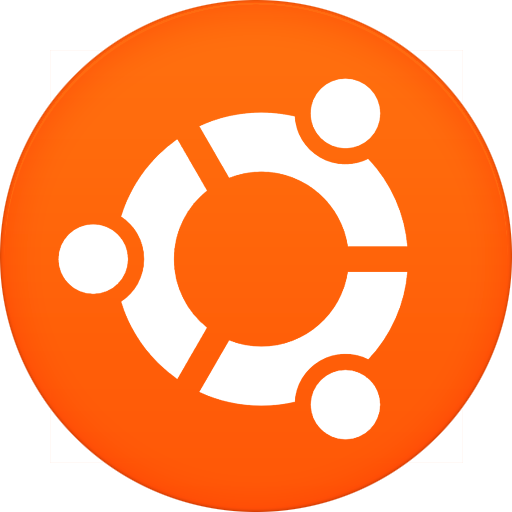
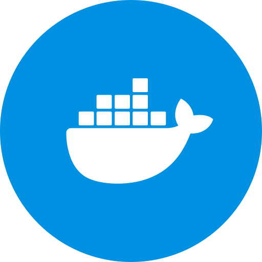
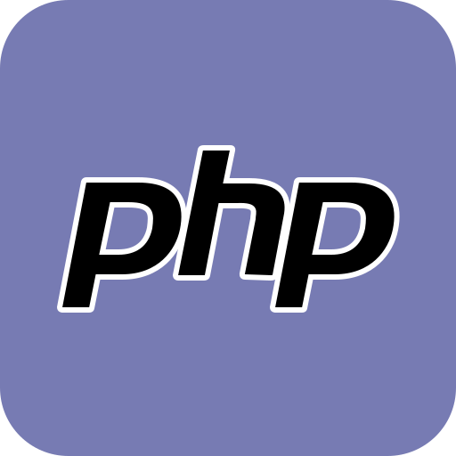
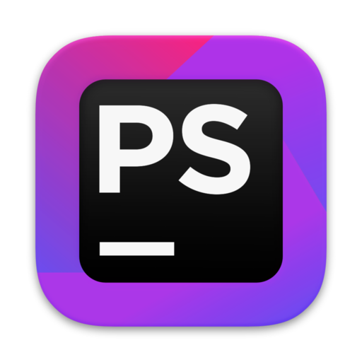
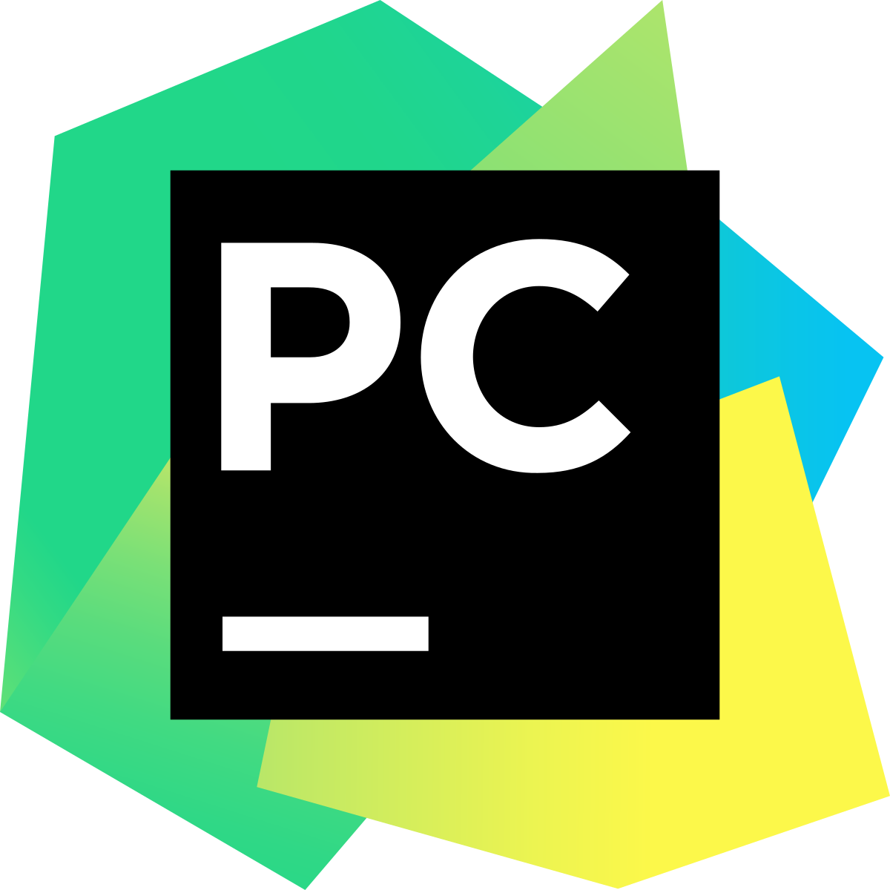
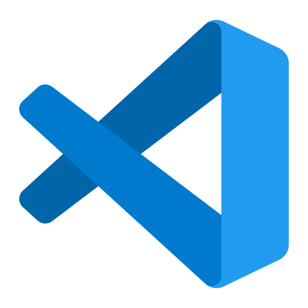
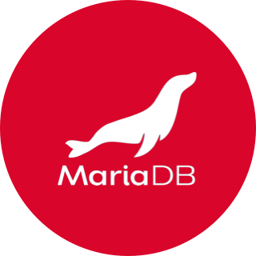
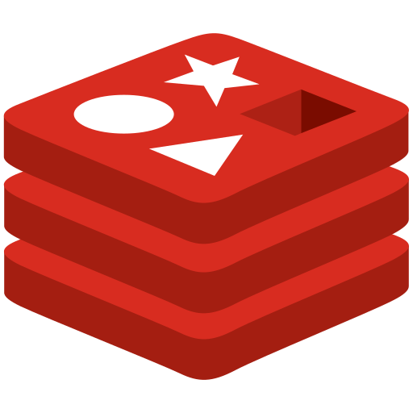

## Всем привет! 👋 
Меня зовут Максим! Я backend-разработчик PHP & Laravel.

### На чём я писал и пишу до сих пор
* **Pascal** - эти школьные годы;
* **Delphi** - формы, кнопочки, весёлые годы университета;
* **C++, C#, VBA for MicroStation** - от техника до ведущего инженера;
* **PHP** - умею, ежедневно, люблю. От CMS до самописных систем;
* **Python, Go** - учу, применяю, начинаю любить.

### Мемы в телеге:
[**Грузите эйрподсы бочками!**](https://t.me/seoblock)

### Мои контакты

<a href="https://t.me/coolycow" style="display: inline-flex; align-items: center; line-height: 25px; text-decoration: none;">
    
    https://t.me/coolycow
</a>

### Что использую в работе
            